# 📊 Análisis exploratorio del catálogo de iTunes Store USA

## 🎯 Objetivo del análisis

Explorar la estructura de precios, duración, géneros musicales y características especiales de las canciones y álbumes en iTunes Store USA, con el objetivo de identificar patrones, outliers y posibles oportunidades de automatización.

---

## 📦 Distribución de precios, duración y variables clave

## Hallazgos clave
- Los precios de canciones y álbumes están sesgados a la derecha. La mayoría de los productos (canciones y álbumes) tienen precios bajos, típicamente entre 0.99 y 1.29 USD para canciones y un rango económico para álbumes.
Sin embargo, existe un número reducido de productos con precios muy altos 
 
- En disCount (total de discos en la coleccion) el boxplot muestra que la gran mayoría de los álbumes tienen 1 solo disco, aunque la presencia de valores atípicos indica que hay álbumes que contienen más de 4 o 5 discos, y en algunos casos, cifras significativamente mayores (por ejemplo 10, 15...).

- El histograma de trackTimeMillis muestra que la mayoría de las canciones tienen una duración que se concentra en un rango inferior a los 5 minutos. Sin embargo, se observan barras sueltas a la derecha del histograma, lo que indica la presencia de un número reducido de canciones muy largas. El boxplot evidencia numerosos valores atípicos (outliers) por encima del bigote superior del gráfico. Estas canciones outliers suelen superar los 10 minutos de duración, lo que es inusual en la música comercial estándar.

### `collectionPrice`
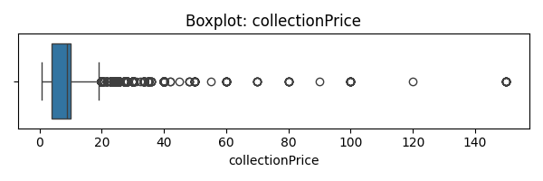
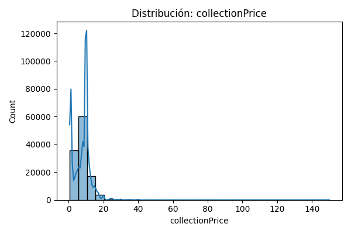

### `discCount`
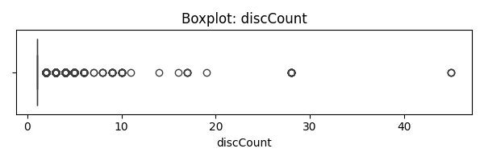
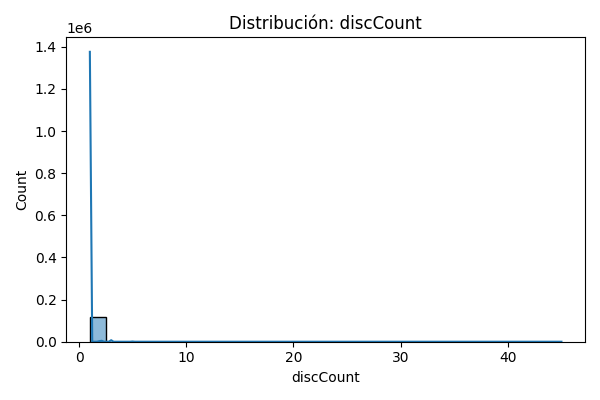

### `trackPrice`
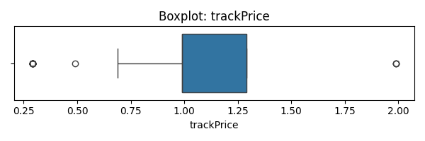
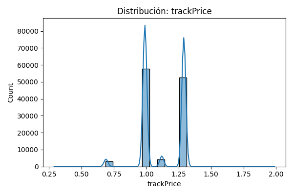

### `trackCount`
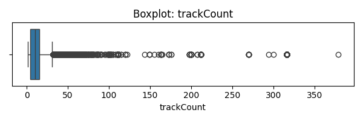
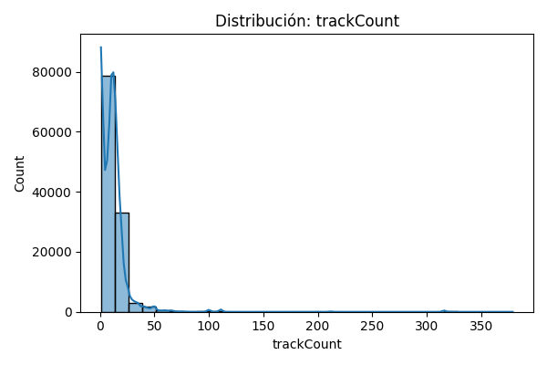

### `trackTimeMillis`
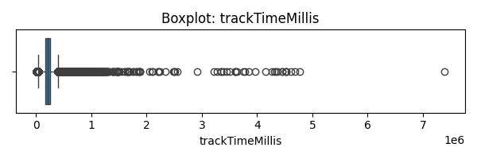
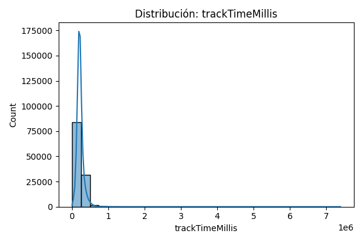

---

## 🚨 Outliers y su explicación

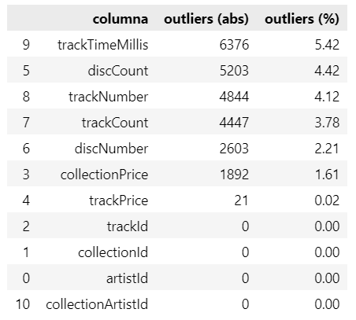

Los valores atípicos en `collectionPrice` se explican por colecciones especiales o "deluxe" con múltiples discos (`discCount`) o muchas canciones (`trackCount`). Estos álbumes representan una parte pequeña del catálogo pero tienen un impacto notable en la distribución de precios.

También se identificaron valores atípicos en trackTimeMillis. Estas duraciones excesivamente largas, que superan los 10 minutos, se observan como outliers en los gráficos y corresponden generalmente a géneros como jazz, rock progresivo o música clásica. Aunque son inusuales en comparación con la mayoría de canciones (2–5 minutos), no representan errores, sino piezas legítimas y extensas —incluyendo grabaciones en vivo o instrumentales— dentro del catálogo de iTunes.

---

## 🔗 Análisis de correlaciones
 
Las correlaciones son débiles, excepto entre disCount y collectionPrice que existe una correlación moderada (0,48), lo cual sugiere que
que el precio de una colección aumenta con el número de discos y canciones, aunque no de forma perfectamente lineal. 

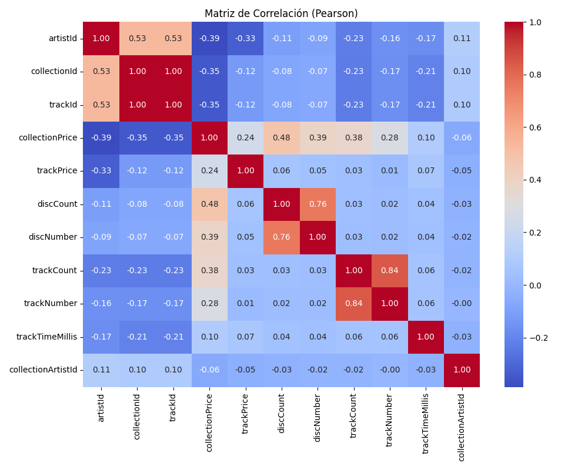

---

## 🧩 Análisis por artista y tipo de explicitud

## Hallazgos clave

- Las canciones limpias (notExplicit) tienden a tener un precio medio más alto y una duración ligeramente mayor que las explícitas (explicit).

- Artistas con precios más altos corresponden en general a contenido más especializado o colecciones.

### Precio y duración por explicitud
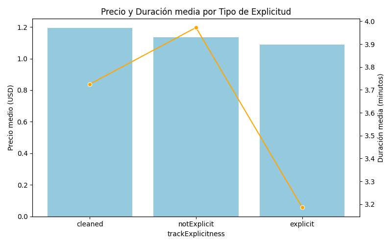

### Precio medio por artista
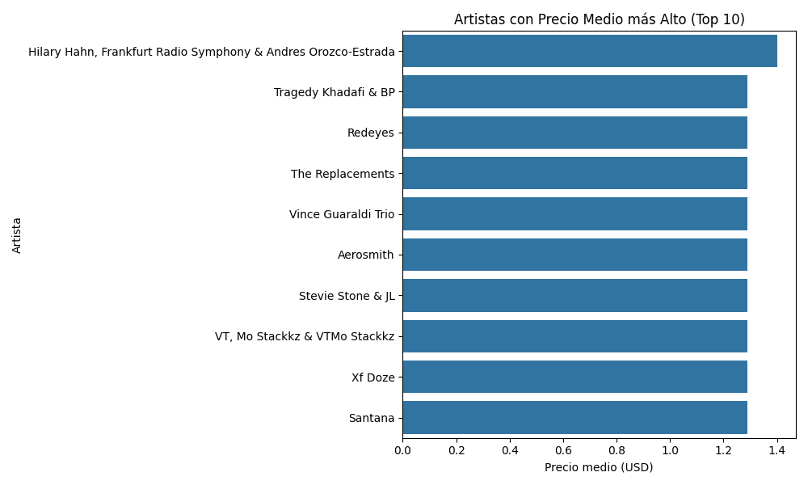

---

## 🎶 Canciones largas y géneros comunes

## Hallazgos clave

- Los géneros predominantes en canciones largas incluyen Classical, Rock y Electronic. Esto explica los valores atípicos en trackTimeMillis

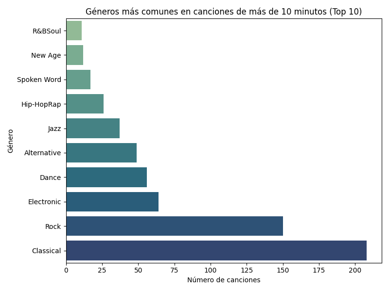

---

## 🎧 Duración y precio medio por género
 
## Hallazgos clave

La duración media varía ampliamente entre géneros, pero el precio medio se mantiene relativamente constante.

Esto sugiere que iTunes no ajusta el precio de forma proporcional a la duración, al menos no de forma directa.

Los géneros con mayor duración están fuertemente ligados a contenido instrumental, regional o narrativo, lo que puede reflejar una mayor riqueza artística o cultural, aunque no se traduzca en un precio más alto.

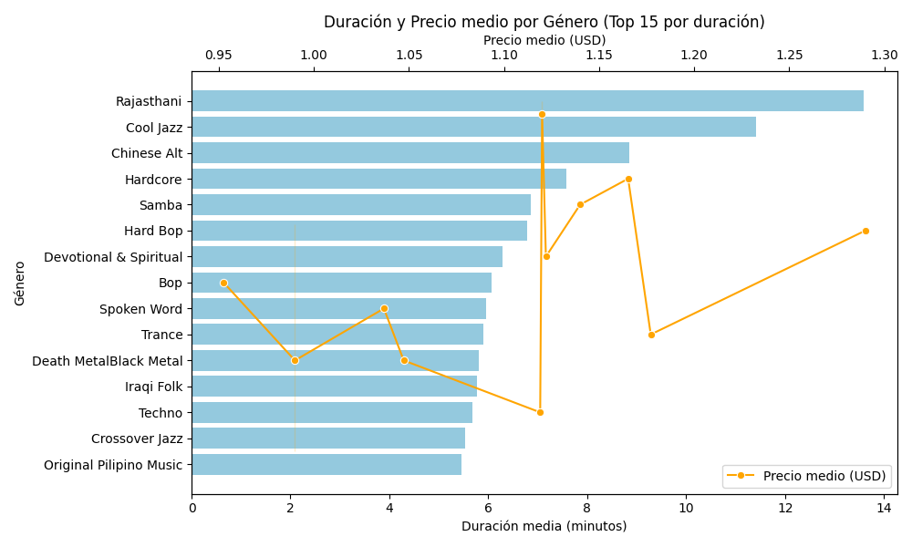

---

## ⏱️ Análisis temporal
 
## Hallazgos clave
 
Se graficó la evolución del precio medio diario de canciones y álbumes según la fecha de scrapeo (checked_at).

No se observaron grandes fluctuaciones, lo que sugiere una política de precios estable, ideal para establecer sistemas de alerta ante futuros descuentos.
 
Por tanto, uno de los objetivos principales que era hacer un análisis histórico de los precios, no es posible hacer ese análisis de forma detallada ni predecir futuros precios porque para ello se necesita extraer datos de varias semanas para poder hacer un análisis temporal

### Evolución del precio medio por álbum
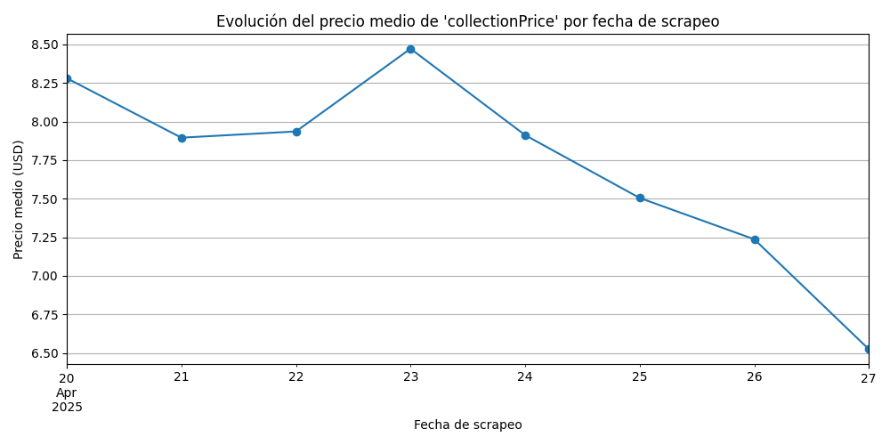

### Evolución del precio medio por canción
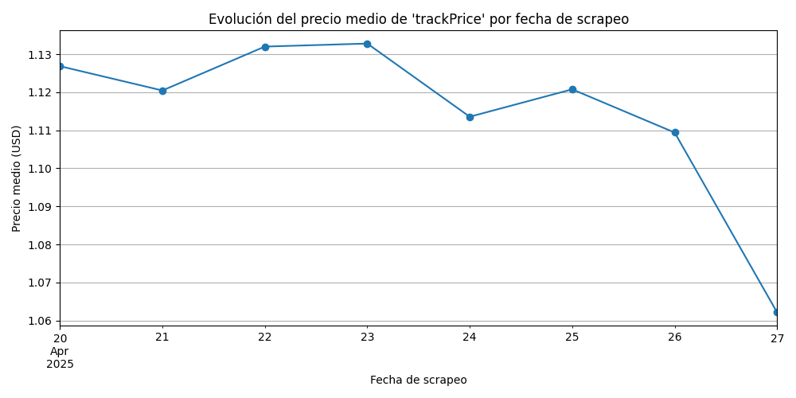

---

## 🧪 Residuos de modelos lineales
 
## Hallazgos clave
 
1. Residuos dispersos en abanico (no aleatorios)
En ambos modelos, los residuos no se agrupan estrechamente alrededor de cero, sino que presentan una gran dispersión y patrones de abanico a medida que aumentan los valores predichos.

Esto indica heterocedasticidad, es decir, que el modelo tiene mayor error a medida que el precio estimado aumenta.

2. No linealidad
El patrón de los residuos sugiere que la relación entre duración y precio no es lineal.

Es decir, aumentar la duración no conlleva un aumento proporcional del precio.

Otros factores (como género, tipo de contenido, artista, etc.) pueden estar influyendo mucho más que la duración.

3. Presencia de outliers
Hay residuos extremos (muy por encima o por debajo de la línea 0), lo cual sugiere:

Algunas canciones o álbumes tienen precios mucho más altos o bajos de lo que la duración esperaría predecir.

Ejemplo: canciones cortas que cuestan mucho (por popularidad), o canciones largas a bajo precio (como piezas clásicas).

### Modelo de predicción de precio de canciones
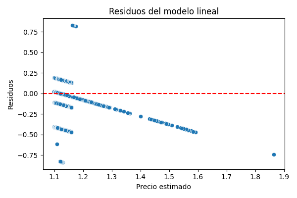

### Modelo de predicción de precio de álbumes
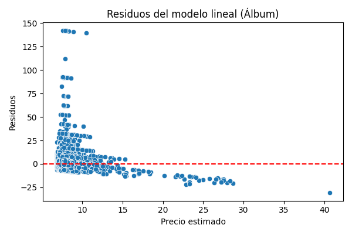

---

## ✅ Conclusiones y próximos pasos

- Existen valores atípicos justificados por la naturaleza del contenido (colecciones extensas).
- `discCount` y `trackCount` están moderadamente correlacionados con el precio de la colección.
- Géneros como el rock o la clásica tienden a tener mayor duración.
- El análisis temporal revela variaciones estables, útiles para detectar descuentos en el futuro.
- Próximo paso: integrar un sistema de alertas basado en historial de precios y disponibilidad en streaming.

---

